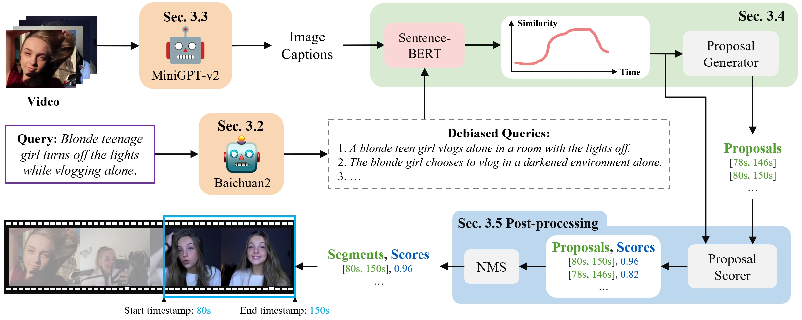

# VTG-GPT

<a href='https://arxiv.org/abs/2403.02076'></a>
[](https://paperswithcode.com/sota/zero-shot-moment-retrieval-on-qvhighlights?p=vtg-gpt-tuning-free-zero-shot-video-temporal-1)

This is our implementation for the paper **VTG-GPT: Tuning-Free Zero-Shot Video Temporal Grounding with GPT**. 

VTG-GPT leverages frozen GPTs to enable zero-shot inference without training.



- [VTG-GPT](#vtg-gpt)
  - [Preparation](#preparation)
  - [Inference on QVHighlights val split](#inference-on-qvhighlights-val-split)
  - [MiniGPT-v2 for Image captioning](#minigpt-v2-for-image-captioning)
  - [Baichuan2 for Query debiasing](#baichuan2-for-query-debiasing)
- [Acknowledgement](#acknowledgement)
- [Citation](#citation)


## Preparation

1. Install dependencies

```sh
conda create -n vtg-gpt python=3.10
conda activate vtg-gpt
pip install -r requirements.txt
```

2. Unzip caption files

```sh
cd data/qvhighlights/caption/
unzip val.zip
```


## Inference on QVHighlights val split

```sh
# inference
python infer_qvhighlights.py val

# evaluation
bash standalone_eval/eval.sh
```

Run the above code to get:

| Metrics| R1@0.5 | R1@0.7 | mAP@0.5 | mAP@0.75 | mAP@avg |
| -----  | ------ | ------ | ------- | -------- | ------- |
| Values | 59.03  | 38.90   | 56.11   | 35.44    | 35.57   |


## MiniGPT-v2 for Image captioning
TODO

## Baichuan2 for Query debiasing
TODO

# Acknowledgement

We thank Youyao Jia for helpful discussions.

This code is based on [Moment-DETR](https://github.com/jayleicn/moment_detr) and [SeViLA](https://github.com/Yui010206/SeViLA). We used resources from [MiniGPT-4](https://github.com/Vision-CAIR/MiniGPT-4), [Baichuan2](https://github.com/baichuan-inc/Baichuan2), [LLaMa2](https://github.com/facebookresearch/llama). We thank the authors for their awesome open-source contributions.


# Citation
If you find this project useful for your research, please kindly cite our paper.
```
@article{xu2024vtg,
  title={VTG-GPT: Tuning-Free Zero-Shot Video Temporal Grounding with GPT},
  author={Xu, Yifang and Sun, Yunzhuo and Xie, Zien and Zhai, Benxiang and Du, Sidan},
  journal={Applied Sciences},
  volume={14},
  number={5},
  pages={1894},
  year={2024},
  publisher={MDPI}
}
```
